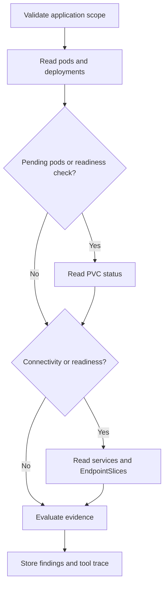

# GTB agentic solution

## Scope and delivery status

This branch adds a bounded, rule-based operations agent and a reference-aligned delivery planner to the existing portal. It does not call an LLM. The diagnostic loop observes workloads, chooses follow-up tools from the evidence, evaluates findings and persists its report. Delivery planning resolves pipeline contracts without executing them.

The existing code-pull, build, provisioning and release execution paths are preserved. The planner does **not** rewire the portal's generic GTB executor, queue pipelines, raise/merge PRs or deploy applications. Reference-aligned automatic execution is a subsequent integration, not a capability claimed by this branch.

GTB includes the existing `GTB-Applications` deployment category. The diagnostic scope catalog additionally supports H2H, Collections, Native-Mobile and Safenet. A namespace scope covers **all workloads in that namespace**; use dedicated namespaces where application isolation is required.

## Repository analysis

| Area | Existing implementation | Implication |
| --- | --- | --- |
| UI | React 18 / TypeScript / Vite, `src/App.tsx` | Extend the current sidebar and authenticated shell. No separate Streamlit application. |
| Running API | `backend/Dockerfile` starts `app.app:app` | Register new routes in `backend/app/app.py`. `main.py` and `extended_main.py` are legacy entrypoints. |
| Identity | `auth.py`, SQLAlchemy/MS SQL `user_store.py` | Reuse current database-backed identity and DevOps checks. |
| Provisioning | `request_service.py`, `pipeline_setup.py`, Kubernetes helpers | Keep the existing pipeline request and approval flows. |
| Delivery | `deployment_management.py`, `deployment_runtime.py`, `deployment_routes.py` | Existing application-specific execution remains the production integration boundary. |
| Monitoring | local Kubernetes reads plus file/pipeline inventory for remote targets | Remote inventory does not establish fresh workload health. Never silently read the local cluster for a remote scope. |
| Audit | Existing requests/tasks use JSON files | New diagnostic reports use an additive SQL table, avoiding a new shared JSON write race. |

## Working reference

Read-only source: [Collections-Dashboard, feature/ui-enhancements](https://github.com/nagarajsingh/Collections-Dashboard/tree/feature/ui-enhancements). No changes were made to that repository.

The planner snapshots the reference JSON mappings under `backend/app/gtb_reference/`, and translates these contracts into explicit application code:

| Reference | Preserved behavior |
| --- | --- |
| `azure_devops.py` | Code pull uses configurable `APP`, `PROFINCH_BRANCH`, `LIST_ONLY`; booleans remain booleans. |
| `build_pipeline_mapping.json` | Application-specific build names and parameter keys, including capitalized `Environment` for OBP/OBTF. |
| `sitecustomize.py` | OBP, OBTF and OBDX select the pipeline YAML branch from the chosen build environment. Other build pipelines retain the configured reference. Implemented directly, without Streamlit monkey patches. |
| `repo_mapping.json`, `pr_branch_mapping.json` | Explicit repositories and environment-specific PR target branches, including distinct kernel branches. Missing mappings block a plan instead of guessing. |
| `pipeline_mapping.json` | Collections country/service mapping and `vendorImage` / `useVendorImage`. |
| `release_helpers.py` | Discover a release by the successful artifact build ID. The new plan deliberately excludes the reference's latest-release fallback because it can identify a different build. No release API implementation is changed. |

Reference blob IDs reviewed: `azure_devops.py` `e84fe9725b29a41922248b96a24af4c3684f17aa`, `sitecustomize.py` `d5a778c8963d30c769a1515f980b57d53e8797f9`, `release_helpers.py` `aa18175334c710d107d1da2124ab5cc284bfddc9`. Mapping snapshots are versioned with this branch and do not automatically track future reference changes.

Important distinctions:

- The pipeline YAML ref is different from the application's build-source branch.
- Environment values are `R2`, `R2UAT`, `PREPRD`, `R2TRAIN`, `PROD`, `GOLD`. A build environment does not guarantee a PR mapping exists.
- `list_only=true` ends the plan after code pull.
- Kernel components have code-pull/PR mappings but no standalone build mapping in the reference. They require their parent application workflow.
- Collections release creation is governed by existing Azure DevOps triggers and environment approvals. The planner never invents or creates release definitions.
- A build-source branch differing from the mapped PR target is surfaced as a blocker.

## Operator experience

Open **GTB Operations Agent** as a DevOps user.

1. Prepare a GTB or Collections delivery plan. Review the resolved pipeline names, template parameters, YAML refs, PR dependencies and blockers. Preparing a plan performs no external actions.
2. Use existing Deployment Management for execution; compare the planned contract with the configured executor first. Planning is not an approval and does not prove executor parity.
3. Select a configured application scope and run workload-health, connectivity or infrastructure-readiness diagnostics.
4. Inspect findings, recommendations and the actual tool trace. Reports show observation time, incomplete checks and inaccessible resources. Each user sees their own latest 25 stored investigations.

## Diagnostic loop



The loop uses at most five namespaced list calls. Each call requests at most 200 resources with a 3-second connect and 8-second read timeout, with automatic HTTP retries disabled. Truncation makes the result partial; there is no unbounded pagination. These are per-call timeouts, not a strict overall deadline (credential loading and SQL writes may take additional time).

Checks include current image-pull/crash-loop failures, current or previous OOM kills, pod readiness, deployment generation/replica rollout state, unbound PVCs and missing explicitly ready Service endpoints. An unavailable tool is never converted into a healthy result. Diagnostic evidence includes only selected status fields, not logs, Secrets, environment variables or Kubernetes event messages.

Limitations: no application transaction checks, resource-usage metrics, ingress/DNS/TLS/VNet diagnosis, remote-cluster live adapter, model reasoning, background scheduling or automatic remediation. Findings are symptoms and investigation guidance, not proven root causes. A successful infrastructure check is not a release approval.

## Configuration

The delivery planner works without Kubernetes scopes or model credentials. Set `CODE_PULL_PIPELINE_ID` or `CODE_PULL_PIPELINE_NAME` to the same working pipeline configured in the reference application. Optional `CODE_PULL_PARAM_APPLICATION`, `CODE_PULL_PARAM_BRANCH`, `CODE_PULL_PARAM_LIST_ONLY` preserve parameter overrides; defaults are `APP`, `PROFINCH_BRANCH`, `LIST_ONLY`. `AZDO_BRANCH` defaults to `refs/heads/master` for code-pull and Collections planning. Existing portal execution uses its existing `AZURE_DEVOPS_*` settings; planning does not change them.

For diagnostic execution, add an environment variable to the existing backend configuration:

```json
[
  {
    "id": "gtb-uat",
    "application": "GTB-Applications",
    "cluster": "local-cluster",
    "namespace": "gtb-uat",
    "environment": "UAT"
  }
]
```

Store the compact JSON as `GTB_AGENT_SCOPES`. This is an **example**, not an assertion that `gtb-uat` exists. Replace it with the verified cluster and namespace. The cluster must appear in `KUBERNETES_TARGETS`, and the namespace must appear in `ALLOWED_NAMESPACES` (or that setting must explicitly allow `all`). Duplicate scope IDs or invalid configuration return 503. An empty configuration is valid and displays setup guidance.

Only scopes whose cluster equals `LOCAL_KUBERNETES_TARGET` support live reads in this version. Remote scopes return unavailable evidence rather than a local-cluster fallback. Existing inventory is intentionally not presented as live pod data.

The additive table `gtb_agent_runs` is registered with the existing SQLAlchemy metadata and created by the existing startup `create_all`. The database principal therefore needs table-creation rights on first rollout, or the DBA must create the table from that metadata beforehand. Back up the database using existing procedures. Reports contain internal resource names; restrict database access and define retention operationally. History retrieval is limited to 25 records, but records are not automatically deleted.

Optional namespaced read permissions are in `k8s/gtb-agent/read-access.example.yaml`. Review its namespace and ServiceAccount before applying. It is not included in existing deployment manifests and was not applied during development. Existing cluster-wide roles are unchanged. No `exec`, logs, Secret access or mutation permissions are added.

## API

All endpoints require an authenticated DevOps user; frontend navigation is not the authorization boundary.

| Method | Path beneath `/devops-portal/api` | Purpose |
| --- | --- | --- |
| GET | `/gtb-agent/delivery/catalog` | Known reference components and build environments |
| POST | `/gtb-agent/delivery/plan` | Side-effect-free contract/dependency plan |
| GET | `/gtb-agent/scopes` | Validated configured scopes |
| POST | `/gtb-agent/runs` | Run diagnostics and persist a report |
| GET | `/gtb-agent/runs` | Current user's latest 25 reports |

Example diagnostic body: `{"scope_id":"gtb-uat","objective":"connectivity"}`.

Example delivery body:

```json
{"application":"GTB-Applications","component":"obp","environment":"PREPRD","vendor_branch":"vendor-release-42","build_branch":"release/ppr"}
```

## Recommended next integration

For model-driven, automated delivery, build a coordinator around these typed contracts, not arbitrary generated shell commands:

1. Extract document data into validated GTB/Collections input schemas. Add a configured model adapter only after deciding the permitted model and data boundary. Keep extracted text untrusted.
2. Persist an immutable plan tied to request ID, document hash and branch commit IDs. Reuse the existing owner/DevOps review process.
3. Integrate reference-matching typed execution adapters for code pull, PR creation, build queueing and exact release discovery. Verify remote state before advancing; require a merged PR when applicable.
4. Add a durable worker with per-step idempotency, atomic state transitions and reconciliation of ambiguous timeouts. Never blindly retry a pipeline POST.
5. Gate production/DR deployments on existing release approvals; record environment results and post-deployment checks. A rollback remains a separately authorized operation.

This is the remaining path to autonomous delivery. It is intentionally distinguished from the implemented planning and diagnostic capabilities.

## Validation

```bash
npm install --package-lock=false
npm run build
python -m pip install -r backend/requirements-dev.txt
PYTHONPATH=backend python -m unittest discover -s backend/tests -v
```

Tests cover adaptive tool selection, missing/truncated evidence, namespace restrictions, remote isolation, API authorization, SQL persistence/history isolation, Collections contracts, GTB runtime branch overrides, list-only behavior and missing mappings. Unit/API tests use synthetic Kubernetes evidence and SQLite for isolated persistence. Live Azure DevOps, MS SQL/ODBC, Kubernetes, browser interaction and production deployment were not exercised in this workspace.
